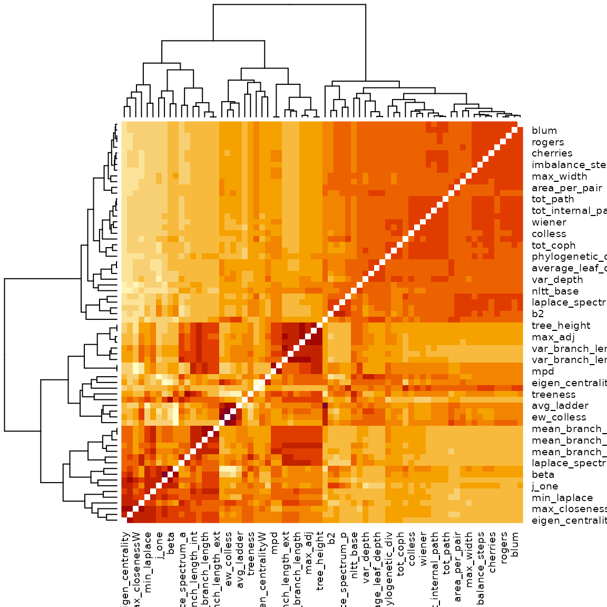

# Example: data

## Data

The treestats package can rapidly calculate summary statistics on
phylogenetic trees, and in this vignette, we demonstrate this on
empirical trees. We will make use of family-level pruned trees stemming
from the clootl supertree of birds. These were created for the original
publication accompanying the treestats paper.

``` r
focal_trees <- ape::read.tree(file = "https://raw.githubusercontent.com/thijsjanzen/treestats-scripts/main/datasets/phylogenies/fracced/birds.trees")  # nolint
```

We can now calculate all summary statistics for all trees:

``` r
all_stats <- c()
for (i in seq_along(focal_trees)) {
  if (!ape::is.ultrametric(focal_trees[[i]])) {
    testthat::expect_output(
    focal_trees[[i]] <- phytools::force.ultrametric(focal_trees[[i]])
    )
  }
  focal_stats <- treestats::calc_all_stats(focal_trees[[i]])
  all_stats <- rbind(all_stats, focal_stats)
}
```

    ## Loading required namespace: RSpectra

``` r
all_stats <- as.data.frame(all_stats)
```

We can now, for instance, plot the distribution of family sizes in
birds:

``` r
hist(all_stats$number_of_lineages)
```


Furthermore, we can make a heatmap of all correlations:

``` r
cor.dist <- cor(all_stats)
diag(cor.dist) <- NA
heatmap(cor.dist)
```



This will generate a distorted image: correlations are not corrected for
tree size. We can study this a bit more in detail:

``` r
opar <- par()
par(mfrow = c(3, 3))
for (stat in c("area_per_pair", "colless", "eigen_centrality",
               "four_prong", "max_betweenness", "max_width",
               "mntd", "sackin", "wiener")) {
  if (stat != "number_of_lineages") {
    x <- all_stats[, colnames(all_stats) == "number_of_lineages"]
    y <- all_stats[, colnames(all_stats) == stat]
    plot(y ~ x, xlab = "Tree size", ylab = stat, pch = 16)
  }
}
```


``` r
par(opar)
```

    ## Warning in par(opar): graphical parameter "cin" cannot be set

    ## Warning in par(opar): graphical parameter "cra" cannot be set

    ## Warning in par(opar): graphical parameter "csi" cannot be set

    ## Warning in par(opar): graphical parameter "cxy" cannot be set

    ## Warning in par(opar): graphical parameter "din" cannot be set

    ## Warning in par(opar): graphical parameter "page" cannot be set

To correct for this, we will have to go over the entire correlation
matrix.

``` r
tree_size <- all_stats[, colnames(all_stats) == "number_of_lineages"]

for (i in seq_len(nrow(cor.dist))) {
  for (j in seq_len(ncol(cor.dist))) {
    stat1 <- rownames(cor.dist)[i]
    stat2 <- colnames(cor.dist)[j]
    x <- all_stats[, colnames(all_stats) == stat1]
    y <- all_stats[, colnames(all_stats) == stat2]

    a1 <- lm(x ~ tree_size)
    a2 <- lm(y ~ tree_size)
    new_cor <- cor(a1$residuals, a2$residuals)
    cor.dist[i, j] <- new_cor
  }
}
diag(cor.dist) <- NA
heatmap(cor.dist)
```


A nicer way to visualize this is given by the package ppheatmap:

``` r
if (requireNamespace("pheatmap")) pheatmap::pheatmap(cor.dist)
```


