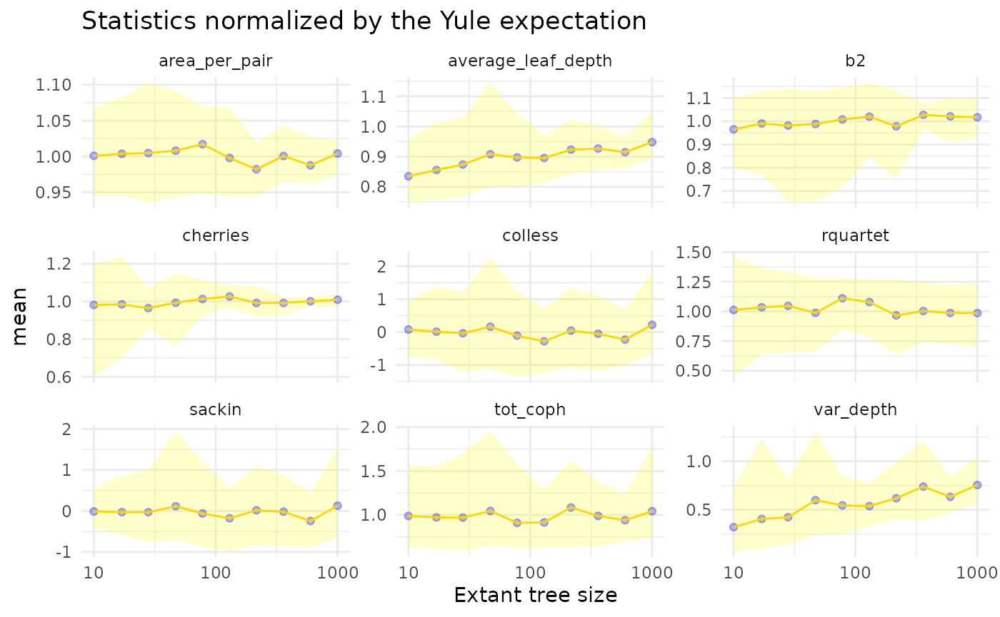
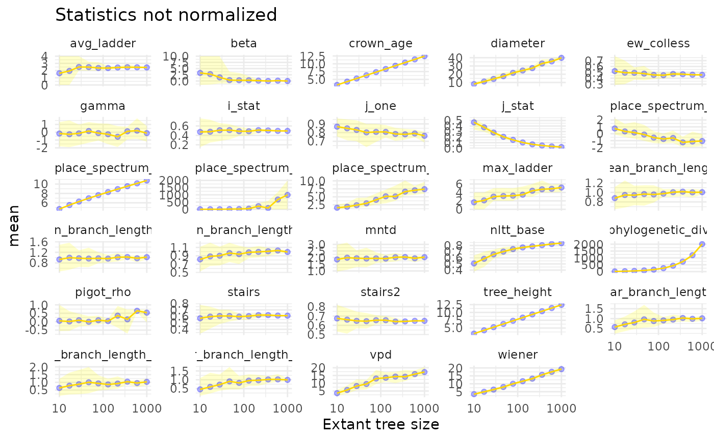

# tree_size

## Tree Size

Most summary statistics for phylogenetic trees are sensitive to tree
size. Fortunately, some statistics provde corrections for tree size,
based on the expectation for the statistic under the Yule model. Let’s
explore to what extent these corrections are effective, and to what
extent the non-corrected statistics are influenced by tree size.

### Simulating trees

To simulate trees, we simulate trees under the Yule model, where we vary
the size of the tree, and we also vary the crown age, in order to sample
trees from a similar distribution. We keep the speciation rate constant.
Alternatively, we could also keep crown age constant and vary the
speciation rate.

``` r

found <- c()
found_min <- c()
found_max <- c()
for (tree_size in ceiling(10^seq(1, 3, length.out = 10))) {
  cat(tree_size, "\n")
  stats <- c()

  # more replicates for smaller trees:
  num_repl <- min(100, ceiling(5 + 1000 / tree_size))
  speciation <- 0.5

  # calculate the expected crown age for the relevant tree size:
  max_t <- (1 / speciation) * log(tree_size / 2)

  for (r in 1:num_repl) {
    tree <- TreeSim::sim.bd.taxa.age(n = tree_size,
                                     numbsim = 1,
                                     lambda = speciation,
                                     mu = 0,
                                     age = max_t,
                                     mrca = TRUE)[[1]]
    stats <- rbind(stats, treestats::calc_all_stats(tree, normalize = TRUE))
  }
  stats2 <- apply(stats, 2, mean)

  min_stats <- apply(stats, 2, function(x) return(quantile(x, 0.025)))
  max_stats <- apply(stats, 2, function(x) return(quantile(x, 0.975)))

  found <- rbind(found, stats2)
  found_min <- rbind(found_min, min_stats)
  found_max <- rbind(found_max, max_stats)
}
```

    ## 10

    ## Loading required namespace: RSpectra

    ## 17 
    ## 28 
    ## 47 
    ## 78 
    ## 130 
    ## 216 
    ## 360 
    ## 600 
    ## 1000

``` r

found <- as_tibble(found)
found_min <- as_tibble(found_min)
found_max <- as_tibble(found_max)
```

### Yule trees

Before plotting relationships, we collect information on the type of
normalization applied to each statistic.

``` r

norm_info <- read.table("https://raw.githubusercontent.com/thijsjanzen/treestats-scripts/main/datasets/normalize.txt", header = TRUE) # nolint

found2 <- found |>
  tidyr::gather(key = "statistic", value = "mean", -number_of_lineages)


found_min2 <- found_min |>
  tidyr::gather(key = "statistic", value = "min", -number_of_lineages)
found_max2 <- found_max |>
  tidyr::gather(key = "statistic", value = "max", -number_of_lineages)

found3 <- left_join(found2, norm_info,
                    by = join_by(statistic))
found3 <- left_join(found3, found_min2,
                    by = join_by(statistic, number_of_lineages))
found3 <- left_join(found3, found_max2,
                    by = join_by(statistic, number_of_lineages))
```

Now, we can plot the relationship between tree size and the statistic:

``` r

found3 |>
  filter(normalize == TRUE & type == "Yule") |>
  ggplot(aes(x = number_of_lineages, y = mean)) +
  geom_ribbon(aes(ymin = min, ymax = max), fill = "yellow", alpha = 0.2) +
  geom_point(col = "blue", alpha = 0.3) +
  geom_line(col = "gold") +
  scale_x_log10() +
  facet_wrap(~statistic, scales = "free_y", ncol = 3) +
  theme_minimal() +
  xlab("Extant tree size") +
  ggtitle("Statistics normalized by the Yule expectation")
```



We see that variation in statistic values is reduced, but not zero.

### Normalization by tree size

For some statistics, no expectations based on the Yule model are
available, and instead, we can normalize by the number of tips. We then
find:

``` r

found3 |>
  filter(normalize == TRUE & type == "Tips") |>
  ggplot(aes(x = number_of_lineages, y = mean)) +
  geom_ribbon(aes(ymin = min, ymax = max), fill = "yellow", alpha = 0.2) +
  geom_point(col = "blue", alpha = 0.3) +
  geom_line(col = "gold") +
  scale_x_log10() +
  facet_wrap(~statistic, scales = "free_y", ncol = 4) +
  theme_minimal() +
  xlab("Extant tree size") +
  ggtitle("Statistics normalized by tree size")
```


Clearly, this is not perfect either.

### No normalization

Lastly, we have those statistics for which no normalization is available

``` r

found3 |>
  filter(normalize == FALSE) |>
  ggplot(aes(x = number_of_lineages, y = mean)) +
  geom_ribbon(aes(ymin = min, ymax = max), fill = "yellow", alpha = 0.2) +
  geom_point(col = "blue", alpha = 0.3) +
  geom_line(col = "gold") +
  scale_x_log10() +
  facet_wrap(~statistic, scales = "free_y", ncol = 5) +
  theme_minimal() +
  xlab("Extant tree size") +
  ggtitle("Statistics not normalized")
```



Here we now see clear patterns with tree size. This is worrying, as for
some statistics, patterns might arise that are simply a side-effect of
creating larger trees, rather than directly influencly the statistic of
choice. Overall, it appears there are few statistics insensitive to tree
size. When the Yule model correction is used, this tends to work when we
are looking at trees of varying size that generated under the Yule
model, but when the generating model is different, the correction no
longer works. See the original treestats paper (Janzen & Etienne 2024)
for a more thorough study on this.
