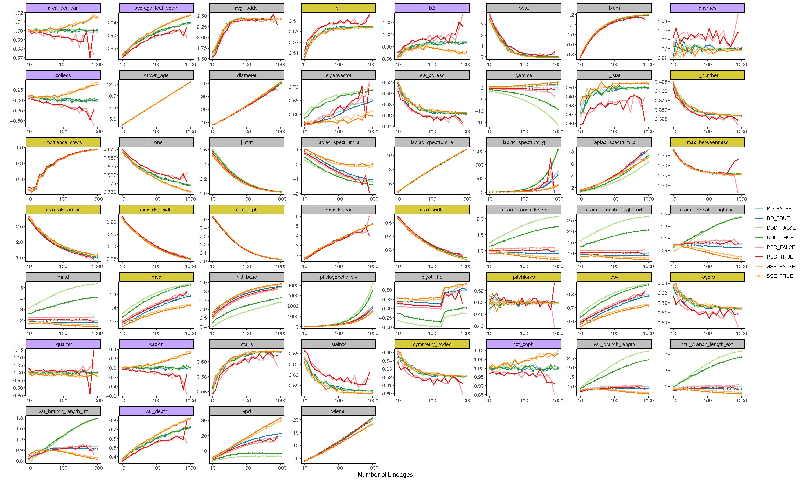

```{r setup, include=FALSE}
knitr::opts_chunk$set(echo = TRUE)
knitr::opts_chunk$set(fig.width = 7)
knitr::opts_chunk$set(fig.height = 5)
```

Many tree statistics allow for a correction of the statistic due to covariance
with tree size. However, it is often not clear whether this works correctly. 
Furthermore, often these corrections are based on expectations under a certain
tree model (often Yule or PDA). 
Here, I look at whether these corrections work at all, or whether they only
work for the matching tree model.


First, I inferred the expected crown age for a tree of N tips, which follows the
expectation: T = 1/lambda * log(N) - 0.42 / lambda, where lambda is the
diversification rate and N is the number of tips. Then, for each model I
simulated 10,000 trees per tree size, where tree size varied in 10 ^ [1, 1.1, 1.2,
..., 3.0], adjusting the crown age correspondingly.
I simulated trees under four different models, being Birth-Death,
DDD, PBD and SSE, using a diversification rate of 0.5 and an extinction rate 
of 0.1 (or 0.0, in the absence of extinction). I explored the models
as follows:

-	Constant Rates Birth-Death model
-	Diversity-Dependent Diversification model  (Etienne et al., 2012), with K set
to 300 + 20% = 360.
-	Protracted birth-death model (Etienne & Rosindell, 2012) with lambda
(speciation completion) at 10, no incipient speciation and the extinction rate
of good and incipient species equal.
-	State dependent diversification model (FitzJohn, 2012) with b0 and mu0 equal
to the speciation and extinction rate, and b1 and mu1 equal to 1.5 times b0 and
mu0. We set q01 = 0.1 and q10 = 0.1. 

### Results

Observed variation of tree statistics, shown are the mean values across 10,000 replicates per point. Gold colored statistics use the number of tips to normalize the summary statistic, Purple colored statistics use the expectation under the Yule model to normalize the summary statistic. Grey colored tree statistics do not provide the option to normalize for tree size. It is clear that very few summary statistics are able to adequately correct for tree size (e.g. rquartet or pitchforks), or are only able to do so when the generating model is similar to the Yule model (e.g. Area per pair, Colless, Sackin and Total Cophenetic Index).  

## Discussion
We find that only the rquartet and pitchforks statistics are able to get rid of any correlation with tree size, regardless of the underlying model. For the area per pair, Colless, Sackin and total cophenetic index we find that these statistics can adequately normalize the found results, but only if the model used to simulate the tree matches that for the expectation, which is a Yule model. In all other cases, we find that tree size, even after correction, still correlates with the summary statistic.

A potential explanation for this remaining variation, even after correction, could be that smaller trees are a random subsample of all potential trees, and that the correction factor does not take this into account. This may explain why for many statistics that do claim to normalize, there seems to be an asymptotic value that is approached with increasing tree size.


### References
Etienne, R. S., Haegeman, B., Stadler, T., Aze, T., Pearson, P. N., Purvis, A., & Phillimore, A. B. (2012). Diversity-dependence brings molecular phylogenies closer to agreement with the fossil record. Proceedings. Biological Sciences / The Royal Society, 279(1732), 1300–1309. https://doi.org/10.1098/rspb.2011.1439

Etienne, R. S., & Rosindell, J. (2012). Prolonging the past counteracts the pull of the present: Protracted speciation can explain observed slowdowns in diversification. Systematic Biology, 61(2), 204–213. https://doi.org/10.1093/sysbio/syr091

FitzJohn, R. G. (2012). Diversitree: Comparative phylogenetic analyses of diversification in R. Methods in Ecology and Evolution, 3(6), 1084–1092. https://doi.org/10.1111/j.2041-210X.2012.00234.x
